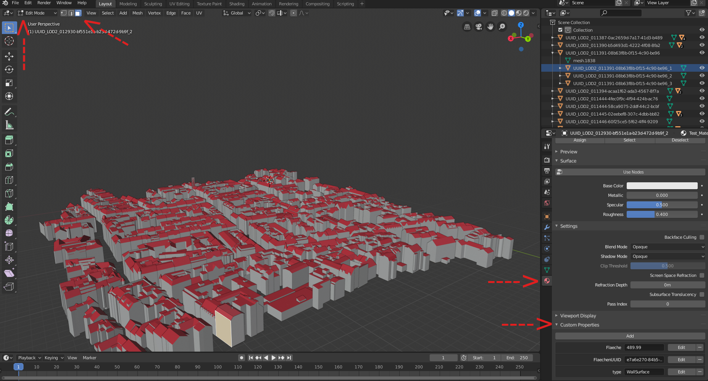

# Up3date

*This plugin was originally developed by Konstantinos Mastorakis ([konmast3r](https://github.com/konmast3r/)) as part of their research orientation project for the MSc Geomatics programme of TU Delft.*

A Blender plugin to import edit and export new instances of 3D city models encoded in the [CityJSON](http://cityjson.org) format. All building attributes and semantic surfaces are stored and can be accesed via Blender's graphical interface.

## Requirements

- Blender Version >=2.80

## Testing Datasets

You can find sample datasets at the official [CityJSON](https://www.cityjson.org/datasets/#datasets-converted-from-citygml) website. In case you have 3D City Model datasets encoded in CityGML you can use the free [Conversion Tool](https://www.cityjson.org/help/users/conversion/) to convert to and from CityGML and CityJSON.

Trying to import really big datasets such as `New York` will take several minutes because of the amount of information contained. With the rest sample CityJSON files everything should work noticeably faster. Depending on your machine, it could take some seconds up to few minutes minute to import the 3D City Model. 

## Installation

1. Download this repository as zip (through GitHub this can be done through the `Clone or download` > `Download ZIP` button).

2. Run `Blender` and go to `Edit > Preferences > Add-ons` and press the `Install...` button.

3. Select the downloaded ZIP and press `Install Add-on from File...`.

4. Enable the plugin from the list, by ticking the empty box next to the add-on's name. (Optional: If this is an update, un-tick and tick again the plugin to reload it!)

## Usage

- In case you run `Blender` through the console, useful feedback is given in it, informing about the progress of the import and export process. Upon importing and exporting from `Blender` it might prove quite useful since in the case of big files it can take up to several minutes.* 
**\*Important: Make sure `Blender's` viewport is in `Object Mode` before importing and exporting a cityjson file.**

- `Blender` translates the 3D city model at the beginning of the axis upon importing. The translation parameters and the `CRS` are visible under the `World Properties` for transforming the coordinates back to original if needed.

 

### Importing a 3D city model

Go to `File > Import > CityJSON (.json)` and navigate to the directory where the CityJSON file is stored and open it.

#### Options

The following options are available during file selection:

* `Materials' type`:
    * `Surfaces` will create materials according to semantic surfaces (e.g. RoofSurface, WallSurface), if present, and load their attributes.
    * ` City Objects` will create materials per city object and according to the city object's type (e.g. Building, Road).
* `Reuse materials`: Enable this if you want semantic surface materials to be reused when they share the same type. For example, all `RoofSurface` faces will have the same materials. *This only work when `Surfaces` are selected as `Materials' type`.*  
**\*Important: Greatly improves speed of loading, but semantic surfaces' attributes can be lost, if present!** 
* `Clean scene`: Enable this if you want the script to clean the scene of any existing object prior to importing the CityJSON objects.

#### Useful tips

- After a successful import, you should be able to see the model somewhere close to the axis origin. Rotation of the scene and zooming in and out might prove useful at this point, to locate the model. 
In case you can't see the model, select an object from the `Outliner` (always in `Object Mode`) and click `View > Frame Selected` or use the `home` button of your keyboard and zooming in.  
**\*Important: Make sure the object you are selecting is a `mesh object`. You can check that from the small pointing down triangle icon next to the object's name.** 

- A different `Collection` is created for each `LoD` respectively. In case more than 1 geometries exist for the objects -representing different `LODs` (level of detail)-, every geometry is stored under the appropriate `Collection`, under the parent object (if there is any). You can display different `Collections` by clicking on the `eye icon` in the `Outliner` at the top right of the interface (see screenshot below). By default all the `LOD_x` collections should be visible right after importing the 3D City Model. In case you see any artefacts that is the reason! Choosing only one visible collection should remove all artefacts. 

- In case you want to visualize a certain area, click `Shift + B` and draw a rectangle with your mouse to zoom into that specific area of the 3D City Model. This also moves the rotation center at that poin, which will come handy when you want to rotate the model for further inspection.

- To see the attributes of each object, simply select the object on the screen and click on the `Context.Object` tab on the bottom right (Blender 2.80 interface). Then click `Custom Properties` drop down menu (see screenshot below).

- To see the semantics of each surface, select an object in `Object Mode`, hit `TAB` to toggle `Edit Mode` and click `Face Select` (top left of the viewport between the `Edit Mode` and the `View` button). Select a face of the object and click on the `Context.Material` tab at the bottom right. Scroll down and click on `Custom Properties`(see screenshot below).

 

### Exporting a 3D city model

`Up3date's` exporting module was desinged and implemented in order to be able to export any scene of `Blender` into a `CityJSON` file.

To do so and because there are certain differences between the two data models some conventions were made. In order to export objects from `Blender's` scene the following steps need to be followed:

1. For every `LoD/geometry` a mesh has to be added into `Blender's` scene. In case there are already created `collections` from a previously imported `CityJSON` file it is not necessary to add the `LoD/geometry` into it but recommended for organization purposes. 

\*Important: The mesh should be named in a predefined way for `Up3date` to be able to parse it correctly. Example: a single `LoD0` geometry should be added and named as `0: [LoD0] ID_of_object` preserving also the spaces.

For every `mesh/geometry` 2 more things needs to be added as `custom properties`  
* `type`: the_surfacetype *(Surface, MultiSurface, CompositeSurface and Solid are accepted)* 
* `lod` : the_number_of_lod

 

2. An empty object has to be created with `ID_of_object` as its name. That object is an umbrella for the various LoD geometries. All the `CityObject's` attributes are stored  within  this  object  as `custom  properties`.   In case the attributes have to be nested, for example the `postal code` of an `address` then the `custom property` key should be `address.postalcode` so `Up3date` can understand the nested attribute structure from the `.` and handle it accordingly.

3. If the semantics of a *(`LoD 2` or above)* `geometry` surfaces are known  they can be assigned as `materials` to the respective faces. The only information `Up3date` parses is the name of the `material/semantic`.

4. Finally, go to `File > Export > CityJSON (.json)` and export the new instance.

## Further Development

If you are using Visual Studio Code, you may:

- Install [Blender Development](https://marketplace.visualstudio.com/items?itemName=JacquesLucke.blender-development): a plugin that allows starting and debugging Python scripts from VSC.
- Install the [fake-bpy-module](https://github.com/nutti/fake-bpy-module) to enable auto-completion: `pip install fake-bpy-module-2.80`.

The general rule to follow is: Clone this repository and have fun! 
If you experience any bugs or have recommendations etc, you can open a new issue, providing all the necessary information. I can't promise to take them all under consideration but I always appreciate them.