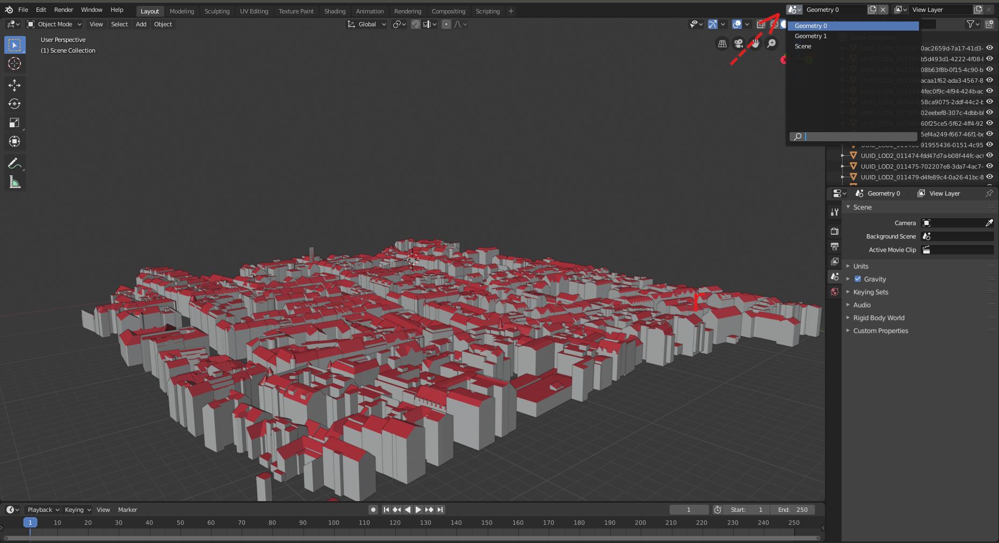

# Blender-CityJSON-Plugin

A Blender plugin to import 3D city models encoded in the [CityJSON](http://cityjson.org) format.

## Requirements

- Blender Version >=2.80

## Testing Datasets

You can find sample datasets at the official [CityJSON](https://www.cityjson.org/datasets/#datasets-converted-from-citygml)website. For the `New York` ,`Zurich` and `Railway`, the plugin will most probably crash due to the very big size of the first two datasets and to the templates structure of the last which is not yet supported by the plugin. 

For the rest sample CityJSON files everything should work smoothly. Depending on your machine it could take some seconds up to a minute to import the model. 

## How to install and use the parser

1. Download the `CityJSON_Blender_parser.py` add-on, and install it locally to Blender. Menu `Edit > Preferences >Add-ons`, and `Install`. 

2. Make sure the add-on is enabled (by default it is disabled).

3. Go to `File > Import > CityJSON` and navigate to the directory where the CityJSON file is stored and open it.

4. If you want to visualize a certain area, click `Shift + B` and draw a rectangle with your mouse to zoom in into that specific area of the dataset.

5. To select all the children of a building right click on the building's (parent's) ID and click `Select Hierarchy`

6. To see the properties of each object simply select the object and click on the `Context.Object` tab on the bottom right (Blender 2.80 interface). Then click the `Custom Properties` drop down menu. (See the screenshot below!)

7. To see the semantics of each surface select an object in `Object Mode` then hit `TAB` to enter `Edit Mode` and click `Face Select` (top left of the viewport next to the `View` button). Then click on the `Context.Material` tab at the bottom right. Then scroll down and click on the `Custom Properties`. (See the screenshot below!)

8. In case more than one geometries exist for the objects, for every geometry a new `Scene` is created and the objects represented in that geometry are rendered into that `Scene`. You can alternate among different `Scenes` by clicking on the scene browser on the top right of the interface. (See the screenshot below!) 

 

## Development

Clone this repository and have fun!

If you are using Visual Studio Code, you may:

- Install [Blender Development](jacqueslucke.blender-development
): a plugin that allows starting and debugging Python scripts from VSC.
- Install the [fake-bpy-module](https://github.com/nutti/fake-bpy-module) to enable auto-completion: `pip install fake-bpy-module-2.80`.
